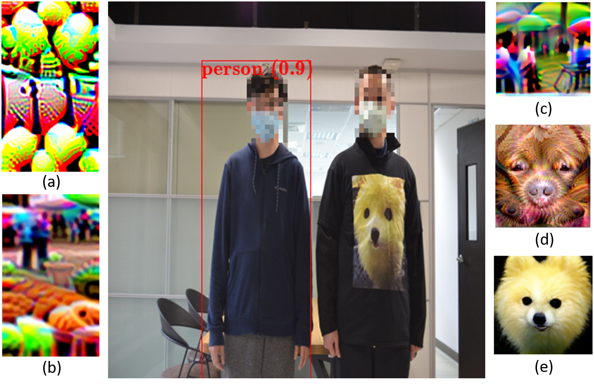

## Accepted at ICCV 2021 !!

## Naturalistic Physical Adversarial Patch for Object Detectors 

<!-- Official PyTorch implementation of **Re-labeling ImageNet** | [Paper](https://arxiv.org/abs/2101.05022) | [Pretrained Models](#experiments)  -->

<!-- **[Sangdoo Yun](https://sangdooyun.github.io/), Seong Joon Oh, Byeongho Heo, Dongyoon Han, Junsuk Choe, Sanghyuk Chun** -->
<!--  -->
<!-- NAVER AI LAB -->
Aiiu-lab @ Academia Sinica

</img>

### Abstract
Most prior works on physical adversarial attacks mainly focus on the attack performance but seldom enforce any restrictions over the appearance of the generated adversarial patches. This leads to conspicuous and attention-grabbing patterns for the generated patches which can be easily identified by humans. To address this issue, we propose a method to craft physical adversarial patches for object detectors by leveraging the learned image manifold of a pretrained generative adversarial network (GAN) (e.g., BigGAN and StyleGAN) upon real-world images. Through sampling the optimal image from the GAN, our method can generate natural looking adversarial patches while maintaining high attack performance. With extensive experiments on both digital and physical domains and several independent subjective surveys, the results show that our proposed method produces significantly more realistic and natural looking patches than several state-of-the-art baselines while achieving competitive attack performance.


## News
- **Aug 26, 2021**: Open source

## Installation
### Dependancies
Install PyTorch and Torchvision as following [official PyTorch instruction](https://pytorch.org/get-started/locally/)
```bash
conda install pytorch==1.6.0 torchvision==0.7.0 cudatoolkit=10.1 -c pytorch
```

Install other packages using the following command:
```bash
pip install -r requirements.txt
```
### Dataset
Download the INRIA dataset using following command:
```bash
bash download_inria.sh
```

Check the dataset position:
```
Naturalistic-Adversarial-Patch                           
 └─── dataset
        └───── inria
                └───── Test
                        └───── ...
                └───── Train
                        └───── pos
                                └───── yolo-labels_yolov4tiny
                                └───── *.png
                                └───── ...
 
```
                                              
## How to Run

### Test an adversarial patch:
```bash
CUDA_VISIBLE_DEVICES=0 python evaluation.py --model yolov4 --tiny --patch ./patch_sample/v4tiny.png
```

### Train an adversarial patch:
```bash
CUDA_VISIBLE_DEVICES=0 python ensemble.py --model=yolov4 --tiny --seed=11177
```


## Citation

```
@inproceedings{hu2021naturalistic,
  title={Naturalistic Physical Adversarial Patch for Object Detectors},
  author={Hu, Yu-Chih-Tuan and Kung, Bo-Han and Tan, Daniel Stanley and Chen, Jun-Cheng and Hua, Kai-Lung and Cheng, Wen-Huang},
  booktitle={Proceedings of the IEEE/CVF International Conference on Computer Vision (ICCV)},
  year={2021}
}
```
