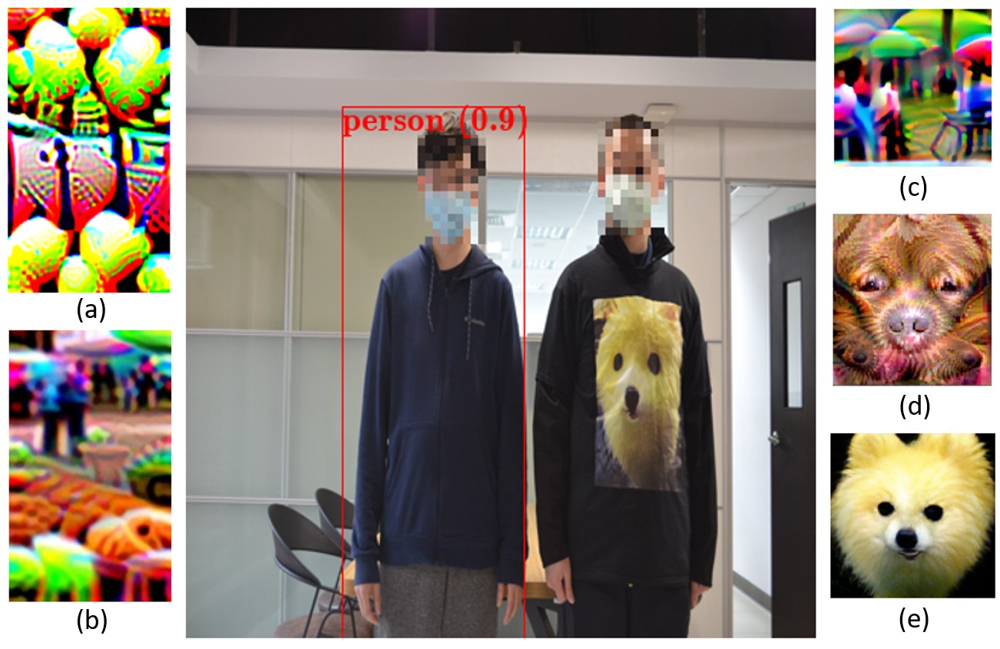

## Accepted at ICCV 2021 !!

## Naturalistic Physical Adversarial Patch for Object Detectors 

<!-- Official PyTorch implementation of **Re-labeling ImageNet** | [Paper](https://arxiv.org/abs/2101.05022) | [Pretrained Models](#experiments)  -->

<!-- **[Sangdoo Yun](https://sangdooyun.github.io/), Seong Joon Oh, Byeongho Heo, Dongyoon Han, Junsuk Choe, Sanghyuk Chun** -->
<!--  -->
<!-- NAVER AI LAB -->
Aiiu-lab @ Academia Sinica

</img>

### Abstract
Most prior works on physical adversarial attacks mainly focus on the attack performance but seldom enforce any restrictions over the appearance of the generated adversarial patches. This leads to conspicuous and attention-grabbing patterns for the generated patches which can be easily identified by humans. To address this issue, we propose a method to craft physical adversarial patches for object detectors by leveraging the learned image manifold of a pretrained generative adversarial network (GAN) (e.g., BigGAN and StyleGAN) upon real-world images. Through sampling the optimal image from the GAN, our method can generate natural looking adversarial patches while maintaining high attack performance. With extensive experiments on both digital and physical domains and several independent subjective surveys, the results show that our proposed method produces significantly more realistic and natural looking patches than several state-of-the-art baselines while achieving competitive attack performance.


## News
- **Aug 26, 2021**: Open source

## Installation
### Clone the code and build the environment
Clone the code:
```bash
git clone https://github.com/aiiu-lab/Naturalistic-Adversarial-Patch
cd Naturalistic-Adversarial-Patch
```
Build the environment and install PyTorch and Torchvision as following [official PyTorch instruction](https://pytorch.org/get-started/locally/)
```bash
conda create -n advpatch python=3.7
conda activate advpatch
conda install pytorch==1.6.0 torchvision==0.7.0 cudatoolkit=10.1 -c pytorch
```

Install other packages using the following command:
```bash
pip install -r requirements.txt
```
### Dataset
Download the INRIA dataset using following command:
```bash
bash download_inria.sh
```
The original INRIA dataset comes from [INRIA](http://pascal.inrialpes.fr/data/human/).

Check the dataset position:
```
Naturalistic-Adversarial-Patch                           
 └─── dataset
        └───── inria
                └───── Test
                        └───── ...
                └───── Train
                        └───── pos
                                └───── yolo-labels_yolov4tiny
                                └───── *.png
                                └───── ...
 
```

### Pretrained weights  
The proposed method needs a GAN and a detector to generate an adversarial patch. 
You can download the necessary weights by running the following command:
- BigGAN:
```bash
bash ./GANLatentDiscovery/download_weights.sh
```
- YOLOv4 and YOLOv4tiny:
```bash 
bash ./pytorchYOLOv4/weight/download_weights.sh
```
- YOLOv3 and YOLOv3tiny:
```bash 
bash ./PyTorchYOLOv3/weights/download_weights.sh
```
- YOLOv2:
```bash 
bash ./adversarialYolo/weights/download_weight.sh
```
## How to Run
After you prepare the weights and dataset, you can evaluate or generate a naturalistic adversarial patch:
### Test an adversarial patch:
```bash
CUDA_VISIBLE_DEVICES=0 python evaluation.py --model yolov4 --tiny --patch ./patch_sample/v4tiny.png
```
- `--model`: detector model. You can use yolov2, yolov3, yolov4, or fasterrcnn.
- `--tiny`: only works for YOLOv3 and YOLOv4. To use TOLOv4tiny, enable this argument.
- `--patch`: the patch position. 

### Train an adversarial patch:
To train an adversarial patch using YOLOv4tiny:
```bash
CUDA_VISIBLE_DEVICES=0 python ensemble.py --model=yolov4 --tiny
```
- `--model`: detector model. You can use yolov2, yolov3, yolov4, or fasterrcnn.
- `--tiny`: only works for YOLOv3 and YOLOv4. To use TOLOv4tiny, enable this argument.
- `--classBiggan`: the class of generated patch. You can choose from 0 to 999 (ImageNet pretrained). 

The result (i.e, adversarial patch) will be saved at exp/exp{experiemnt id} automatically.
You can use tensorboard to check the training history: 
```bash
tensorboard --logdir=./exp 
```

## Credits
- BigGAN code and weights are base on: [GANLatentDiscovery](https://github.com/anvoynov/GANLatentDiscovery)

- StyleGAN2 code and wieghts are based on: [stylegan2](https://github.com/NVlabs/stylegan2)

- YOLOv2 and adversarial patch codes are based on: [adversarial-yolo](https://gitlab.com/EAVISE/adversarial-yolo)

- YOLOv3 code and weights are based on: [PyTorch-YOLOv3](https://github.com/eriklindernoren/PyTorch-YOLOv3)

- YOLOv4 code and weights are based on: [pytorch-YOLOv4](https://github.com/Tianxiaomo/pytorch-YOLOv4)
## Citation

```
@inproceedings{hu2021naturalistic,
  title={Naturalistic Physical Adversarial Patch for Object Detectors},
  author={Hu, Yu-Chih-Tuan and Kung, Bo-Han and Tan, Daniel Stanley and Chen, Jun-Cheng and Hua, Kai-Lung and Cheng, Wen-Huang},
  booktitle={Proceedings of the IEEE/CVF International Conference on Computer Vision (ICCV)},
  year={2021}
}
```
